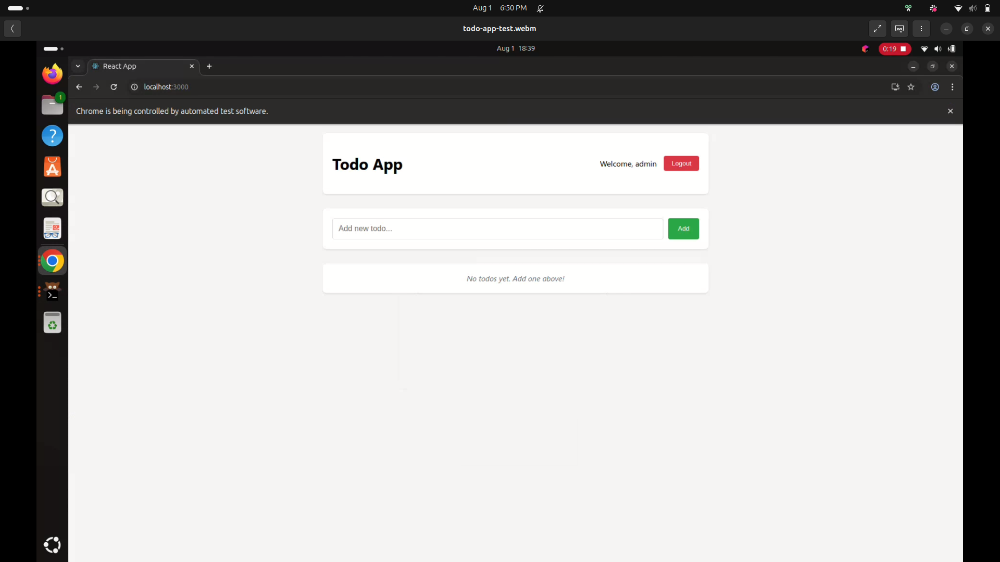

# Seletest - Todo Application Test Automation

## Prerequisites
- Docker + Docker Compose

## Setup & Run

### 1. Start Applications
```bash
docker-compose up -d
```
- Frontend: http://localhost:3000
- Backend: http://localhost:3001

### 2. Run API Tests
```bash
cd todo-api-test
./mvnw clean test
```

### 3. Run Selenium Tests
```bash
cd todo-ui-test
./mvnw clean test
```

Add `-Dheadless` flag to run in head mode:
```bash
./mvnw test -Dheadless=false
```

### 4. Generate Allure Reports
After running tests, generate reports:
```bash
./mvnw allure:serve
```

### 5. Stop Applications
```bash
docker-compose down
```

## Demo Credentials
- Admin: `admin` / `password`
- User: `user` / `123456`

---

For detailed test strategy, see [test_plan.md](test_plan.md)

*NOTE*
If test fails while running in headmode (-Dheadless = false), re-run the command ``` docker compose up ```
.Test App manually on http://localhost:3000

[](docs/todo-app-test.webm)
(download the preview)